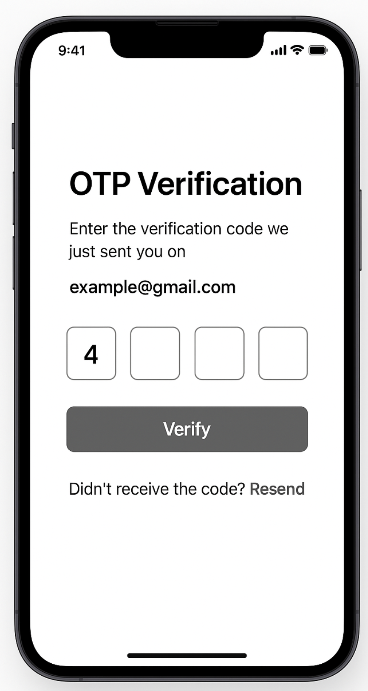

# Bootcamp to Creative Dock

### Intro

Hello, if you find yourself reading this, you might be already in process of hiring or found this by accident why browsing the internet. The goal of this repo is to challenge yourself a little bit. You might be asking why just a little bit, well let's not waste much of your time and even a little bit can be enough to assess your skills. 

This task is straightforward but you can let your creativity run wild with it, and by creativity I mean specifically code. The instructions are there to be followed but the code structure, practices and architecture are up to you.

We would like to see the best of you, so don't feel too shy to go a little extra with what you deliver, *DO NOT* let the simplicity of the task fool you. Your goal should be to deliver maintainable code, that would be reviewed by your colleagues and later used in a production environment. It will not, but play along. Also OTP screen is a thing often reused for validating payments or changing your passcode. So think about that as well.

### Process

We aim to have this process as simple as possible, read the task assignment, create a fork and submit merge request and send us email (you can find my email on my gitlab profile). Afterwards we will review the process and let you know back.

### Hints

As mentioned above, think of scale, reusability, and good practices, really make the best out of this, even if it should be just a practice for you and would not be something anyone would see otherwise.

Is AI bad? I don't think so, can it cause harm in this process? Sure, do not rely on GPT or other tools to get you a job. It should be the best of you, not the best of all the bad code that AI is trained on. If you need a helping hand to solve some styling or problem, sure let's leverage AI.

## Task

### Technologies
- typescript
- react native
- any lib you see fit except for OTP 

## Acceptance Criteria

- OTP should be 4 digits long
- Implement a “Verify” button that logs the full 4-digit OTP to the console and mock network delay
- Resend button should be available only after 60 seconds have passed
  - Time should be visible when the timer is running
- Implement any other features that you see fit for this use case

